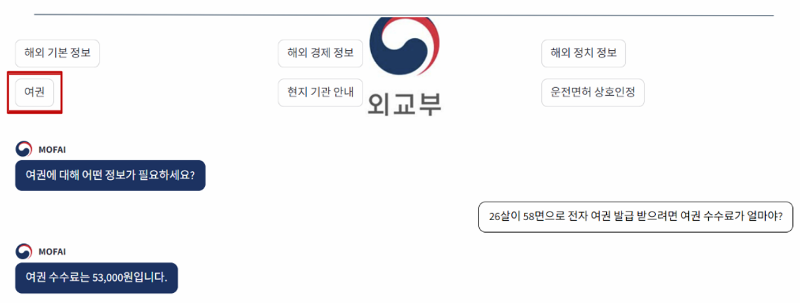
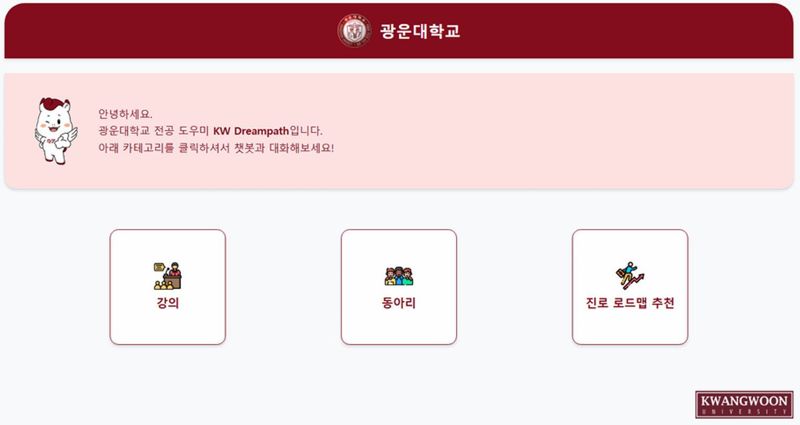
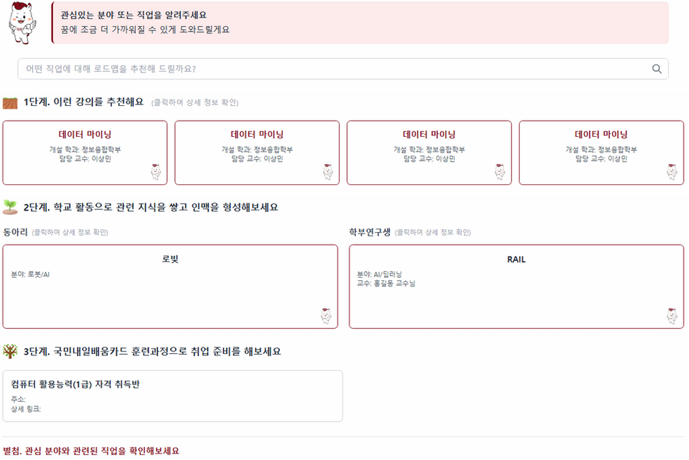

# [Future CV]

> **본 문서는 '오픈소스소프트웨어실습' 과제를 위해 작성된 '가상의 이력서(Future CV)'입니다.**  
---

## 인적 사항

  

- **이름:** 신유림
- **이메일:** [yms08171@gmail.com](yms08171@gmail.com)
- **GitHub:** [github.com/shinyurim0812](https://github.com/shinyurim0812)
- **희망 직무:** AI Engineer / Data Scientist
- **기술 스택:** `Python`, `PyTorch`, `SQL`, `Docker`

---

## 자기소개
> **"데이터 속에서 가치를 찾아내고, 인공지능으로 사용자 경험을 혁신하는 개발자"**
>
> 광운대학교 인공지능융합대학에서 정보융합학을 전공하며 RAG(검색 증강 생성) 파이프라인 구축, 로봇 제어, 챗봇 개발 등 다양한 실무 프로젝트를 주도했습니다. 실생활의 복잡한 문제를 해결하는 AI 솔루션 전문가로 성장하고자 합니다.

---

## 교육 (Education)
- **광운대학교 인공지능융합대학 정보융합학부** (2023.03 ~ 2027.02)
  - **전공 학점:** 4.3 / 4.5
- **SSAFY (삼성 청년 SW 아카데미)수료** (2027.01 ~ 2027.12)
  - **트랙:** Python 실무 응용 및 AI 특화 과정 이수
  - **주요 활동:** 알고리즘 집중 훈련 및 3회의 실무 기반 팀 프로젝트 주도
  - **핵심 성과:** 삼성 SW 우수 교육생 선정

---

## 인턴 경력 
| 기간 | 기관 (회사) | 직무 | 주요 성과 |
| :--- | :--- | :--- | :--- |
| 2028.01 - 2028.06 | **네이버 클라우드** | AI & Data 인턴 | RAG 파이프라인 최적화, 처리 속도 30% 향상 |
| 2025.07 - 2025.12 | **카카오 브레인** | 리서치 인턴 | 한국어 특화 LLM 파인튜닝 및 성능 평가 |
| 2024.01 - 2024.02 | **로보메이션** | 현장실습 | 교육용 로봇 코딩 어시스턴트 챗봇 개발 |

---

## 프로젝트 경험

### 1. [외교부 챗봇 (MOFA Chatbot)](https://github.com/shinyurim0812/mofa_chatbot)

- **설명:** RAG(검색 증강 생성) 기반 외교부 공공데이터 안내 챗봇
- **기술 스택:** `FastAPI`, `PostgreSQL`, `Streamlit`
- **역할:** 데이터 전처리, 벡터 DB 구축 및 LLM 연결

---

### 2. [광운 챗봇 (KW-DreamPath)](https://github.com/minmin-min/KW-DreamPath/tree/main)
|  |  |
| :---: | :---: |
- **설명:** 광운대학교 전공 도우미 맞춤형 챗봇
- **역할:** 맞춤형 카테고리 기획 및 대화 모델 적용

---

### 3. 라즈베리파이 자율주행 차량
  |  
| :---: | :---: |
- **설명:** 카메라 비전을 이용한 자율주행
- **핵심 기술:** `OpenCV`, `CNN`, `TensorFlow`
- **역할:** Softmax 예측 모델 연동 및 정지선 인식 로직 구현

---

## 주요 논문
- **가상 학회지(KIISE) 게재** (2027.06) 
  - 논문 제목: *"한국어 텍스트 특성을 반영한 RAG 임베딩 기법의 검색 정확도 향상에 관한 연구"*
  - 역할: 제1저자 (데이터 샘플링 최적화 및 평가 모듈 설계)

---

## 자격증
- **OPIc AL (Advanced Low)** (2026.12 취득) 
- **정보처리기사** (2026.08 취득)
- **SQLD (SQL개발자)** (2025.04 취득) 
- **SQLp (SQL전문가)** (2027.04 취득) 
---

## 수상 및 공모전
- **제 n회 서울 빅데이터 공모전 최우수상 (서울특별시장상)** (2027.09) 
  - 주제: 공공 생활 이동 데이터를 활용한 서울시 최적 입지 선정 모델 제안
- **2026 K-해커톤 대상 (과학기술정보통신부장관상)** (2026.08)
  - 주제: 시각장애인을 위한 AI 기반 실시간 길안내 서비스 개발
- **네이버 AI 데이터톤 우수상** (2025.10) 
  - 주제: 한국어 방언 데이터의 표준어 변환 NMT 모델 학습 및 최적화

---

## 추천인 
- **박규동 교수님**
  - 소속: 광운대학교 인공지능융합대학 정보융합학부

